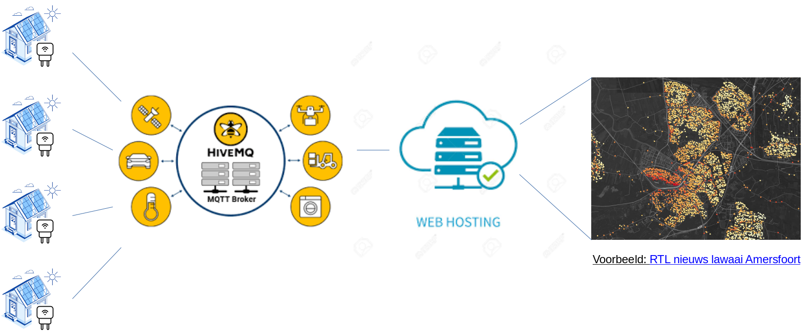

# mjs-voltage

Measure voltages across the entire city

- [Introduction](#introduction)
- [System overview](doc/overview.md)
- [User guide](doc/user-guide.md)
- Deployment guide
    - [Smart plug configuration](doc/deploy/plug-config.md)
    - [Smart plug installation](doc/deploy/plug-install.md)
    - [HiveMQ](doc/hivemq.md)
    - [Web application](doc/dev-setup/webapp.md)
- Development Setup
    - [Local MQTT broker](doc/dev-setup/local-broker.md)
    - [Portable WiFi](doc/dev-setup/rpi-openwrt.md)
    - [Tasmota custom build](doc/dev-setup/tasmota.md)

## Introduction

The energy transition for reducing climate change due to CO2 emissions, puts largely increased demands on the electricity transport network. In short, much of the energy transported as natural gas, will have to be transported as electrical energy in the near future. In the high-voltage backbone network this already results in congestion problems, causing large delays in connecting new solar panel fields, wind turbines and industrial enterprises. See a news message below (in Dutch).

It is only fair to expect that similar congestion problems will occur in the medium- and low-level electricity distribution networks towards households and small enterprises. In fact, the Utrecht City Board recently expressed this as an important concern as soon as 2025, see [this news report](https://www.duic.nl/algemeen/gemeente-utrecht-bezorgd-over-grenzen-van-elektriciteitsnetwerk-die-in-zicht-komen-dit-kan-iedereen-in-de-stad-raken/) (in Dutch).

The transport network operators are not very forthcoming in [acknowledging existing local congestion problems](https://www.stedin.net/aansluiting/ik-ga-energie-opwekken/spanningsproblemen) and first require you to have your in-house network checked by an electrician. They allow you, though, to check whether others have reported network voltage problems in your zipcode area.

A very disconcerning issue for solar panel owners is that local congestion can result in a network voltage larger than 253 Volt, after which the so-called voltage inverter is required to shutdown the current towards the network for a while. Of course, this is most likely to occur around noon, as [shown in this report](https://www.zonnefabriek.nl/nieuws/file-op-het-net-vanwege-weinig-bedrijvigheid-en-veel-zon/) (in Dutch).

The mjs-voltage project documented in this git repository, aims to do a large number of network voltage measurements across the day all over cities like Utrecht and Amersfoort [^1]. In this way, a true overview of local network voltage is obtained. This overview can be published and stimulate the required energy transition.

Present day technology makes it easy to do such measurements and gather them over the internet, see the image below.

So-called smart plugs can be bought cheaply and programmed with some efffort. Cloud services are available that allow to build a Proof-of-Concept system for free, in particular the HiveMQ network for gathering measurements and sites like Streamlit for hosting a visualization.

[^1]: Utrecht and Amersfoort already have an mjs-network in production that measures temperature and air humidity. MJS stands for Meet Je Stad (Measure Your City in English).

