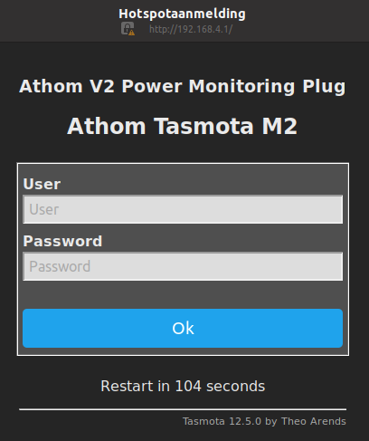
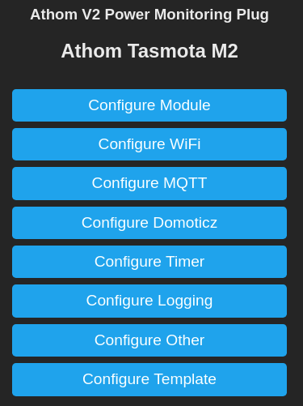

# Configuration of a smart plug

The instructions in this section require a [custom build of the Tasmota firmware](../../doc/dev-setup/tasmota.md).

## Firmware upgrade on preflashed smart plugs

Smart plugs for this project are best purchased as "Tasmota preflashed plugs". An overview of available models can be found [here](https://templates.blakadder.com/preflashed-type.html
). The most popular models can be found at [https://www.athom.tech/blank-1/EU-plug](https://www.athom.tech/blank-1/EU-plug) and [https://nous.technology/product/a1t.html](https://nous.technology/product/a1t.html).

Tasmota preflashed smart plugs allow for [over-the-air upgrading](https://tasmota.github.io/docs/Upgrading/), that is via its web UI over Wi-Fi. To sidestep storage limitations of the ESP8266, the upgrade must be performed in two steps:

1. Upgrade by making the plug download ota.tasmota.com/tasmota/release-12.5.0/tasmota-minimal.bin.gz from the internet
2. Upgrade by uploading the custom build 12.5.0 firmware with MQTT-TLS (tasmota.bin.gz)

This procedure was verified with two Athom V2 plugs, one with an older original Tasmota firmware version: 10.1.0 (device M1) and one with a newer version 13.0.0 (device M2).

## Flashing firmware on smart plugs without tasmota

A lot of [Tasmota-compatible smart plugs](https://templates.blakadder.com/plug.html) are on the market, mostly with Tuya firmware installed. It is not advised to buy these plugs, but their might be special reasons to have such plugs available. In many cases it is possible to flash our custom built Tasmota firmware on such plugs, but the following warrnings apply:

1. Several models that used to be Tasmota-compatible are presently sold with a different microcontroller/Wi-Fi module.

2. In the past, the [Tuya-Convert software](https://tasmota.github.io/docs/Tuya-Convert/) could install Tasmota firmware on Tuya-based smart plugs over Wi-Fi. This is not possible anymore for Tuya-based plugs sold today.

3. Flashing new firmware requires soldering wires on the ESP8266 module inside the plug. Most plugs cannot be [opened without damaging the housing](https://github.com/arendst/Tasmota/discussions/10350) and reassembly after flashing might not restore the full safety level of the plug (think shortcuts and electrical shocks).

4. Flashing the ESP8266 requires a so-called USB-TTL-programmer, but not just any type. Devices based on an 2102 chip do not supply sufficient current to feed the microcontroller. One needs a programmer with a CH340 chip.

5. Controlling the USB-TTL-programmer requires installation of driver software of uncertain origin, unless you use a Raspberry Pi with Raspbian which has the drivers pre-installed.

If these warning do not deter you, pretty nice instructions to follow are provided [here](https://sylvainzimmer.com/blog/2021/09/smart-plugs-tasmota/) and [here](https://www.sbprojects.net/projects/sonoff/). For the current project a few smart plugs from Gosund and Woox were flashed in this way using the bare python esptool package on a Raspberry Pi with Raspbian.

## First operation
When first powering up a smart plug with Tasmota firmware after flashing, upgrading or recovery, the Wi-Fi manager becomes active as a hotspot with an SSID of the form tasmota-ABCDEF-1234. You can connect to it with a laptop or smartphone and then browse to the http://192.168.4.1/ fixed uri (this page might open automatically). Then just fill in the SSID and password of the local Wi-Fi network that the plug should use.

## Configuration overview
For use of a power monitoring plug in the mjs-voltage network the following configurations are minimally required:

- Section *Other*:
    - Template, see [this specific section](#configuring-the-plug-specific-template)
    - Specify a web admin password for basic authentication on the web UI and store it in your password manager
    - Enable MQTT (used for gathering power measurements and for calibration)
    - Device Name (e.g. Athom Tasmota M2, where "M2" is some marker you can add on the physical housing for easy recognition, this name appears in the web UI)
    - Friendly Name (can be the same as the device name, it appears in power-up MQTT messages)
- Section *MQTT*:
    - Host: 0123456789abcdef0123456789abcdef.s2.eu.hivemq.cloud
    - Port: 8883 
    - Enable TLS
    - Client unchanged: DVES_%06X
    - User:     <username> as configured on the HiveMQ admin page
    - Password: <password> as configured on the HiveMQ admin page
    - Topic unchanged: tasmota_%06X
    - Full topic: mjs-voltage/%topic%

## Configuring the plug specific template
After upgrading or flashing, the plugs do not have the right configurations anymore. Configs related to the internal hardware wiring of the smart plug can be restored in the Configure Other section of the plug's web UI by [copying in a so-called template](](https://templates.blakadder.com/plug.html)). Templates for many devices can be found on the earlier mentioned [blackadder.com site](https://templates.blakadder.com/plug.html). Two examples for plugs used in this project are listed below.

Athom v2 plugs (after upgrading to tasmota-12.5.0 with MQTT TLS)    
[https://templates.blakadder.com/athom_PG01V2-EU16A-TAS.html](https://templates.blakadder.com/athom_PG01V2-EU16A-TAS.html)    
\{"NAME":"Athom V2 Power Monitoring Plug","GPIO":[0,0,0,3104,0,32,0,0,224,576,0,0,0,0],"FLAG":0,"BASE":18}

Gosund EP2 plugs (after flashing to tasmota-12.5.0 with MQTT TLS)    
[https://templates.blakadder.com/gosund_EP2.html](https://templates.blakadder.com/gosund_EP2.html)    
\{"NAME":"Gosund EP2 Power Monitoring Plug","GPIO":[576,1,320,1,2656,2720,0,0,2624,32,0,224,0,0],"FLAG":0,"BASE":18}

## Tasmota Wi-Fi behaviour
Although the configuration menu in the Tasmota web UI offers an option to enter alternative values for the ssid and password, the firmware does not try and use these alternative values when the primary values fail. This might be a bug (tested on v 12.5.0 on the Athom v2 and Gosund EP2 plugs). Possibly, the secondary access point settings rather apply to a second Wifi module that can be connected to an ESP32 chip (not for ESP8266).

The behaviour described above implies that outside the reach of the configured Wi-Fi network the Wi-Fi settings of a Tasmota smart plug can only be modified via [device recovery](https://tasmota.github.io/docs/Device-Recovery/). However, device recovery is painful because all settings are reset to firmware defaults.

A workaround during experimentation is to change the [WifiConfig](https://tasmota.github.io/docs/Commands/#wi-fi) from the default *4 = retry other AP without rebooting* to *2 = set Wi-Fi Manager as the current configuration tool*. If the device cannot connect to the Wifi using the primary access point settings, the [WifiManager](https://github.com/tzapu/WiFiManager/blob/master/README.md#how-it-works) is run for 3 minutes during which the smart plug functions as a Wifi access point and runs a web UI on the 192.168.4.1 IP address (as in the case of [first operation](#first_operation)). There, it is possible to configure new values for the ssid and password.

One can apply this workaround manually by entering the following commands in the *console* of the smart plug's web UI:

- `WifiConfig 2`
- `Restart 1`

Alternatively, you can add `"CMND":"WifiConfig 2"` to the template mentioned earlier. Although the custom Tasmota build allows the WifiManager to be set as a firmware default, this is not recommended because it implies a safety issue: if the primary WiFi is unavailable, anyone in the neighbourhood of the plug can detect it functioning as an access point without WPA2 security. The username/password protection is run by - assumably - vulnerable software. Also, the password can be read in case of physical access to the plug.

When experimenting with these plugs on different locations, it is rewarding to bring your own local Wi-Fi access point and configure the plugs for this AP. Then, the plugs can work independent of the location. A nice solution for a local AP based on a Raspberry Pi is described [here](../../doc/dev-setup/rpi-openwrt.md).

## MQTT smoketest

After configuring the smart plug it is good to do a short smoke test regarding the proper MQTT operation.

Terminal logging of MQTT messages from Athom_M1 (with default TelePeriod 300):

$ mosquitto_sub -h localhost -t +/#

Online
{"ip":"192.168.2.71","dn":"Tasmota","fn":["Tasmota",null,null,null,null,null,null,null],"hn":"tasmota-F17F56-8022","mac":"E09806F17F56","md":"Athom Plug V2","ty":0,"if":0,"ofln":"Offline","onln":"Online","state":["OFF","ON","TOGGLE","HOLD"],"sw":"10.1.0","t":"tasmota_F17F56","ft":"%prefix%/%topic%/","tp":["cmnd","stat","tele"],"rl":[1,0,0,0,0,0,0,0],"swc":[-1,-1,-1,-1,-1,-1,-1,-1],"swn":[null,null,null,null,null,null,null,null],"btn":[0,0,0,0,0,0,0,0],"so":{"4":0,"11":0,"13":0,"17":0,"20":0,"30":0,"68":0,"73":0,"82":0,"114":0,"117":0},"lk":0,"lt_st":0,"sho":[0,0,0,0],"ver":1}
{"sn":{"Time":"2023-06-24T08:39:31","ENERGY":{"TotalStartTime":"2023-06-24T08:32:22","Total":0.000,"Yesterday":0.000,"Today":0.000,"Power": 0,"ApparentPower": 0,"ReactivePower": 0,"Factor":0.00,"Voltage":233,"Current":0.000}},"ver":1}

{"Time":"2023-06-24T09:19:26","Uptime":"0T00:40:09","UptimeSec":2409,"Heap":26,"SleepMode":"Dynamic","Sleep":50,"LoadAvg":19,"MqttCount":1,"POWER":"ON","Wifi":{"AP":1,"SSId":"Beneden","BSSId":"2C:91:AB:45:EE:E1","Channel":1,"Mode":"11n","RSSI":92,"Signal":-54,"LinkCount":1,"Downtime":"0T00:00:03"}}
{"Time":"2023-06-24T09:19:26","ENERGY":{"TotalStartTime":"2023-06-24T08:32:22","Total":0.001,"Yesterday":0.000,"Today":0.001,"Period": 0,"Power": 0,"ApparentPower": 0,"ReactivePower": 0,"Factor":0.00,"Voltage":234,"Current":0.000}}

## Measurement calibration

MQTT Tasmota:           https://tasmota.github.io/docs/MQTT/
MQTT commands Tasmota:  https://tasmota.github.io/docs/Commands/#mqtt

